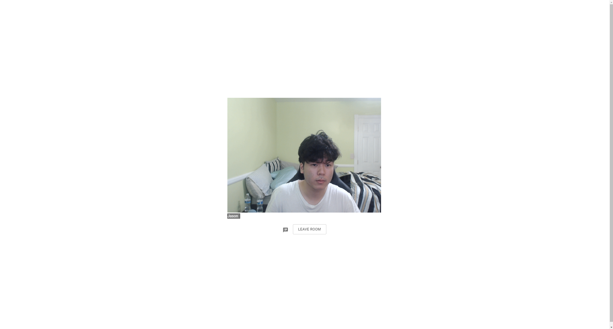

<!-- PROJECT LOGO -->
<br />
<p align="center">
  <a href="https://github.com/github_username/repo_name">
    
  </a>

  <h3 align="center">Zoom Clone</h3>

  <p align="center">
    A clone of the popular video conference app Zoom!
</p>


<!-- TABLE OF CONTENTS -->
<details open="open">
  <summary><h2 style="display: inline-block">Table of Contents</h2></summary>
  <ol>
    <li>
      <a href="#about-the-project">About The Project</a>
      <ul>
        <li><a href="#built-with">Built With</a></li>
      </ul>
    </li>
    <li>
      <a href="#getting-started">Getting Started</a>
      <ul>
        <li><a href="#prerequisites">Prerequisites</a></li>
        <li><a href="#installation">Installation</a></li>
      </ul>
    </li>
    <li><a href="#usage">Usage</a></li>
    <li><a href="#roadmap">Roadmap</a></li>
    <li><a href="#license">License</a></li>
    <li><a href="#contact">Contact</a></li>
    <li><a href="#acknowledgements">Acknowledgements</a></li>
  </ol>
</details>

<!-- ABOUT THE PROJECT -->
## About The Project


<p> After the start of quarantine and the prominence of remote learning began, I was amazed to see the rise of Zoom as the primary method of communciation between teacher and student. Prior to the start of Zoom's popularity, I took for granted the ability to have many particpants in a video conference that ran in an effieicent manner. </p>

<p> Because of this, I was inspired to create a clone of zoom in order to better understand the underlying technologies behind the video conference application as well as to familiarize myself with fullstack web development. </p>

### Built With

* [Electron](https://www.electronjs.org/)
* [React](https://reactjs.org/)
* [DynamoDB](https://aws.amazon.com/)
* [S3](https://aws.amazon.com/)
* [Twilio Programmable Video API](https://www.twilio.com/docs/video)
* [Socket.io](https://socket.io/)
* [Express](https://expressjs.com/)

## Getting Started

To get a local copy up and running follow these simple steps.

### Prerequisites
* npm
  ```sh
  npm install npm@latest -g
  ```

### Installation

1. Clone the repo
   ```sh
   git clone https://github.com/jasondnguyen/zoom_clone_electron.git
   git clone https://github.com/jasondnguyen/zoom-clone-backend.git
   ```
2. Install NPM packages
   ```sh
   npm install
   ```   
<!-- USAGE EXAMPLES -->
## Usage


<p> Upon clicking the join meeting button, the user is presented the join meeting screen that prompts them to enter the room they want to join and their username. </p>


<p> Once they have inputted these details, the user is then allowed to click the join room button, which sends this request the the backend express server. </p>

```bash
router.post('/', (req, res, next) => {
  try {
    const twilioAccountSid = process.env.ACCOUNT_SID;
    const twilioApiKey = process.env.API_KEY;
    const twilioApiSecret = process.env.API_SECRET;
    const identity = req.body.identity;

    const token = new AccessToken(
      twilioAccountSid,
      twilioApiKey,
      twilioApiSecret,
      { identity: identity }
    );

    const videoGrant = new VideoGrant();
    token.addGrant(videoGrant);

    res.send({
      token: token.toJwt(),
    });
  } catch (error) {
    console.log(error);
  }
});
```

<p> The server returns an access token that allows the user to join the twilio video conference room. </p>

```bash
io.on('connection', socket => {
  const { roomId } = socket.handshake.query;
  socket.join(roomId);

  socket.on('newChatMessage', data => {
    io.in(roomId).emit('newChatMessage', data);
  });

  socket.on('disconnect', () => {
    socket.leave(roomId);
  });
});
```
<p> The server also puts the user's socket into the specific room they requested in order to emit chat messages that other users in the room send </p>


<p> In the meeting room, the user has the option of chatting with other users through sending chat messages. </p>


<p> The user also has the option of hiding the chat when they click the chat icon on the bottom row. If the user clicks the leave room button, then they will be sent back the join meeting page. </p>

<!-- ROADMAP -->
## Roadmap

1. Redesign of the meeting room UI using Adobe Xd mock ups.
2. Refactoring of the meeting room code for displaying participant video and audio tracks.
3. Addition of breakout rooms.

## License

Distributed under the MIT License © [Electron React Boilerplate](https://github.com/electron-react-boilerplate)

## Contact

<p>Jason Nguyen - jasondn5@uci.edu</p>
<p>Project Link: https://github.com/jasondnguyen/zoom_clone_electron/</p>


<!-- ACKNOWLEDGEMENTS -->
## Acknowledgements

* [Brad Traversy](https://www.udemy.com/course/modern-react-front-to-back/)
* [Electron-react-boilerplate](https://github.com/electron-react-boilerplate/electron-react-boilerplate)

<!-- MARKDOWN LINKS & IMAGES -->
<!-- https://www.markdownguide.org/basic-syntax/#reference-style-links -->
[contributors-shield]: https://img.shields.io/github/contributors/github_username/repo.svg?style=for-the-badge
[contributors-url]: https://github.com/github_username/repo/graphs/contributors
[forks-shield]: https://img.shields.io/github/forks/github_username/repo.svg?style=for-the-badge
[forks-url]: https://github.com/github_username/repo/network/members
[stars-shield]: https://img.shields.io/github/stars/github_username/repo.svg?style=for-the-badge
[stars-url]: https://github.com/github_username/repo/stargazers
[issues-shield]: https://img.shields.io/github/issues/github_username/repo.svg?style=for-the-badge
[issues-url]: https://github.com/github_username/repo/issues
[license-shield]: https://img.shields.io/github/license/github_username/repo.svg?style=for-the-badge
[license-url]: https://github.com/github_username/repo/blob/master/LICENSE.txt
[linkedin-shield]: https://img.shields.io/badge/-LinkedIn-black.svg?style=for-the-badge&logo=linkedin&colorB=555
[linkedin-url]: https://linkedin.com/in/github_username
